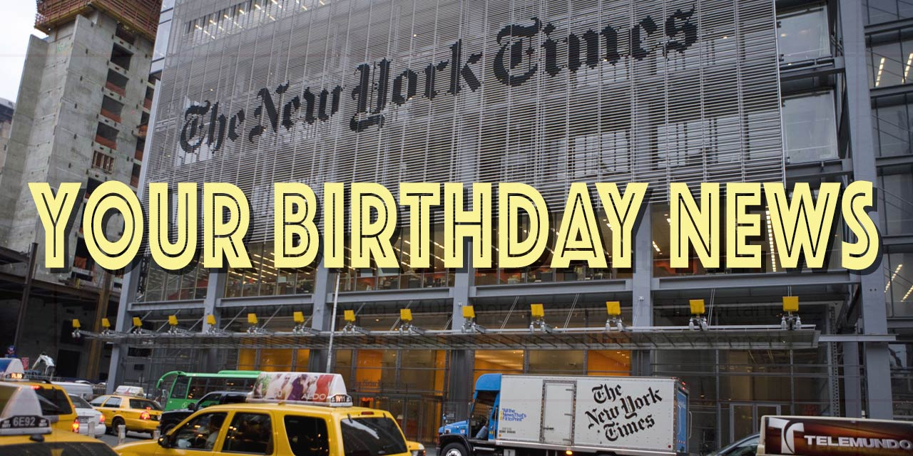

# Your Birthday News

## Give us your birth day, we'll give you the world

This web application use modern Javascript concepts to create a full stack application usig Node.js, MongoDB and React.

You must type your birthday in the format `YYYMMDD`, no spaces, no dashes, no forward slashes, and the app will contact 
**The New York Times API** and give you five top news of the day you were born. 

The archives goes back to 1885. So you can check the news on the day the ***Statue of Liberty*** was inaugurated, on October 28, 1886 (`18861028`), or the day ***Rosa Park***s was born, February 4, 1913 (`19130204`). If you want to know 
more about the news about the ***Triangle Fire*** in New York City, on March 25, 1911, you must search for the day after, or `19110326`.

This MVP app was created on a web development class, and it was my first own "full-stack" project, and was built in 24 hours. 
So the original code might have flaws and lots of console-logs. The goal was to build a **server in Node/Express**, connect to an **API**, retrieve data and store it in a **database (mongoDB)** and display it on the browser (in **React**). This is the orignal app, the front end is just the bare-minimum, as I spend most fo my time on the back end. This is the original code and all its inconsistencies. I only updated the dependencies and typos here and there.

NOTE: To run the program, you will need a API key to access the New York Times archives. This key was not uploaded to this repository for privacy reasons. A key can be obtained with a developer account at `https://developer.nytimes.com`.

Thank you,

Mauricio Feldman-Abe

